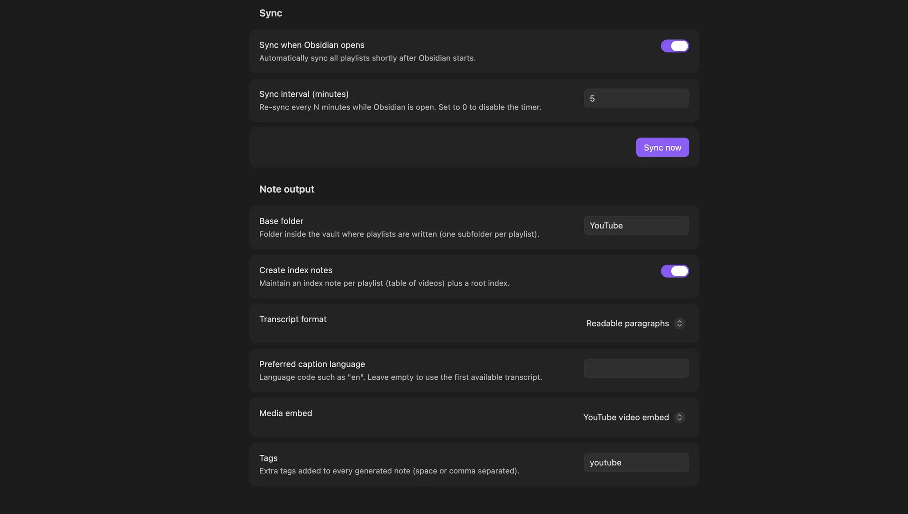
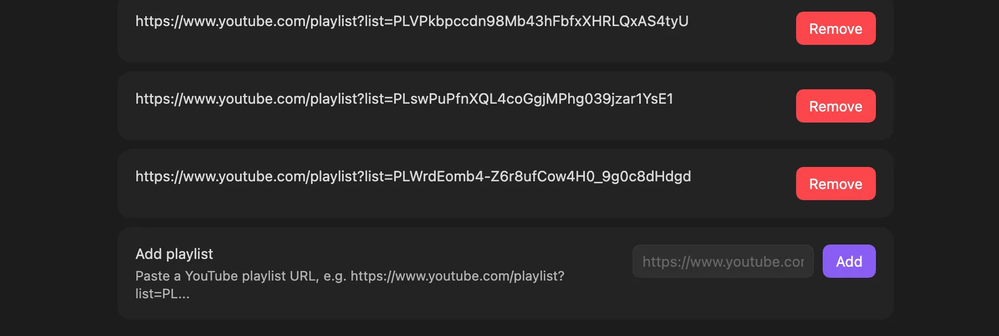
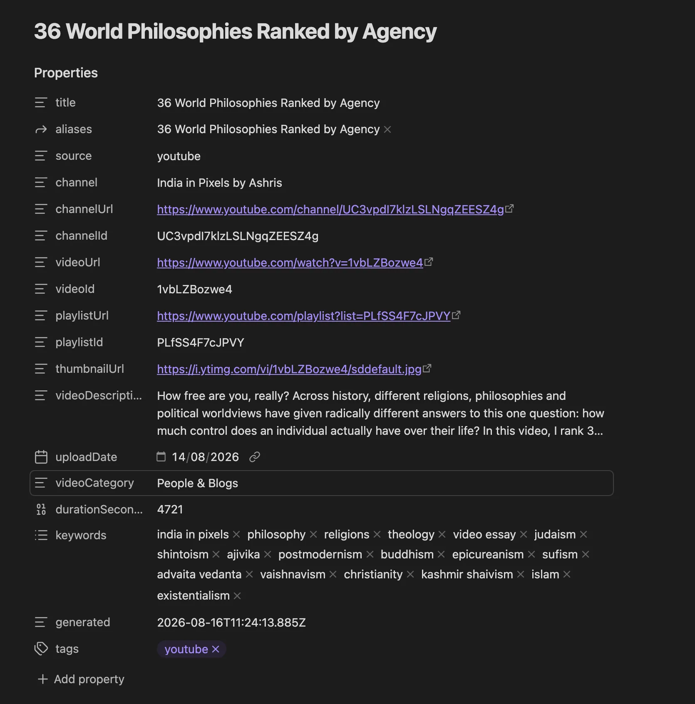
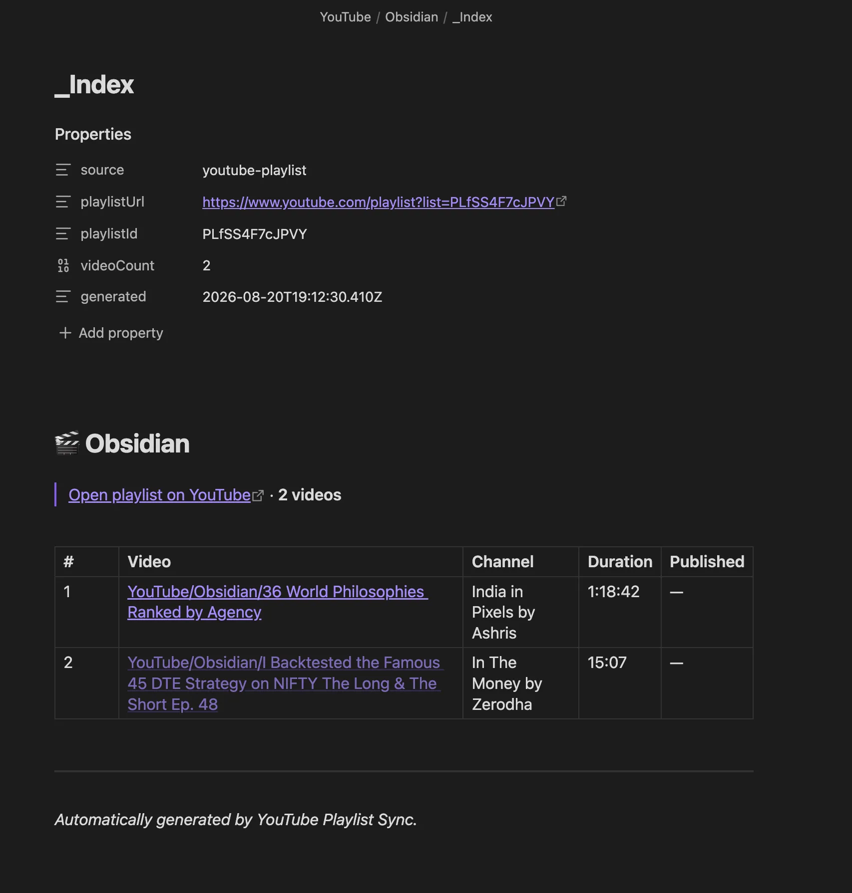
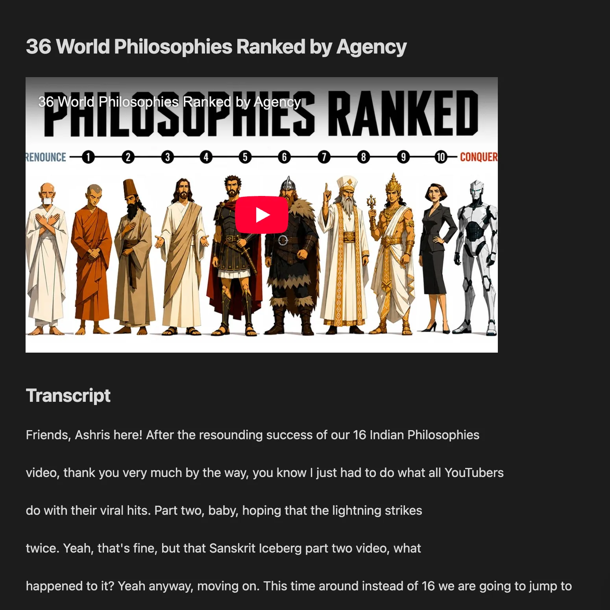
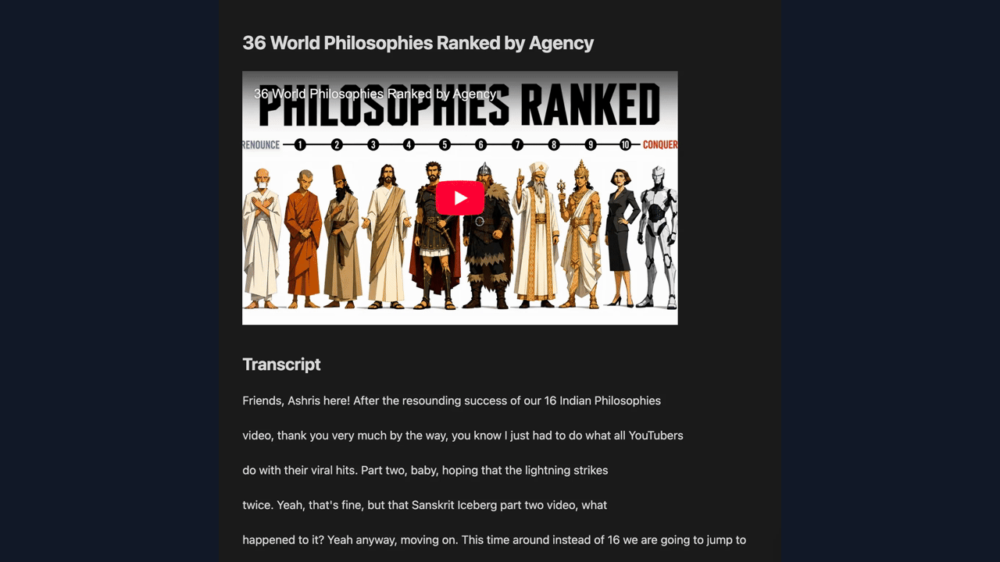

# YouTube Playlist Sync

An Obsidian plugin that automatically syncs **public YouTube playlists** into notes with the
**same metadata as YT Knowledge Notes** (title, channel, URLs, IDs, thumbnail, description,
upload date, category, duration, keywords) plus a **transcript**. YouTube syncing requires no
YouTube API key. Optional AI summaries can use OpenAI, NVIDIA NIM, or another
OpenAI-compatible endpoint chosen by the user.

The plugin supports Obsidian on desktop, iOS, iPadOS, and Android.

## Why this plugin?

- **No YouTube API key:** sync public playlists through the same public data path used by YouTube.
- **Automatic, incremental sync:** create notes for new videos on startup, on an interval, or on demand while preserving your edits.
- **AI is optional:** keep transcripts and metadata local, or add summaries with OpenAI, NVIDIA NIM, or another OpenAI-compatible endpoint when you choose.

## What's new

- **Custom AI instructions:** Keep the built-in summary prompt, append your own guidance, or
  replace the guidance while retaining the structured summary format.
- **Custom video-note properties:** Define video frontmatter with a validated YAML template and
  preview or migrate existing generated notes without changing their bodies.
- **Timestamped summary fix:** Manual and bulk AI summaries now strip the plugin's timestamp links
  before sending transcript text to the selected provider.

## Features

- Fetches each configured playlist straight from YouTube (via the same internal API youtube.com
  uses — no YouTube API key required).
- **First sync**: creates one note per video in `YouTube/<Playlist Name>/`.
- **Later syncs**: only creates notes for videos that are **new** to the playlist. Existing
  user content is preserved.
- Fetches the **transcript** for each video when one exists (readable paragraphs or
  timestamped lines) and embeds the video or thumbnail.
- Maintains an `_Index.md` per playlist (table of all videos) and a root `Index.md`.
- Runs automatically: **when Obsidian opens**, on an **interval while Obsidian is active**, and
  via a **Sync now** command / ribbon button. Mobile re-checks the interval after the app resumes.
- Optional AI summaries with Summary, Key Takeaways, Important Concepts, Action Items,
  and Questions / Things to Explore.
- AI provider presets for **OpenAI** and **NVIDIA NIM**, plus a **Custom OpenAI-compatible**
  endpoint option.
- Users control the AI base URL, API protocol, model ID, and SecretStorage credential.
- AI summaries can run automatically for new notes, manually for the active note, or in bulk
  for existing notes that are missing summaries.
- Regenerating an AI summary replaces only the plugin-managed AI block and preserves the rest
  of the note.
- A validated YAML template controls video-note frontmatter, with an explicit preview-and-confirm
  migration for existing notes.

## Screenshots

### Configure sync and note output



### Manage multiple YouTube playlists



### Generated video note metadata



### Video embed and transcript



### Playlist index with linked notes



### Visual walkthrough



## Integrates well with

- **Dataview:** query the generated frontmatter to build dashboards for channels, playlists, tags, and upload dates.
- **Templater:** use the stable video-note properties as inputs for your own note templates and workflows.
- **QuickAdd:** connect Obsidian commands and capture flows around a repeatable playlist-sync workflow.
- **Excalidraw:** link generated video notes from visual maps, lesson plans, and research diagrams.

## Install

### From the community plugin directory

[Install YouTube Playlist Sync directly from the Obsidian Community Plugins directory](https://obsidian.md/plugins?id=youtube-playlist-sync), then enable it.

### With BRAT

1. Install **BRAT** from the community plugin directory.
2. In BRAT settings, add this repository as a beta plugin.
3. Reload Obsidian and enable **YouTube Playlist Sync**.

### Manually

1. In your vault, open the folder `.obsidian/plugins/` (create it if missing).
2. Create a folder named `youtube-playlist-sync` inside it.
3. Copy **`main.js`** and **`manifest.json`** from the latest release into it.
4. Reload Obsidian and enable the plugin under **Settings → Community plugins**.

## Setup

1. **Settings → YouTube Playlist Sync → Playlists** — paste a public playlist URL
   (e.g. `https://www.youtube.com/playlist?list=PL...`) and click **Add**. Repeat for as many
   playlists as you want.
2. Click **Sync now** (or the ribbon icon, or the command palette →
   "Sync YouTube playlists now").

The first sync creates all video notes; later syncs only add new ones.

## Settings

| Setting | Default | What it does |
| --- | --- | --- |
| Playlists | — | Public YouTube playlist URLs to sync |
| Sync when Obsidian opens | on | Run a sync shortly after Obsidian starts |
| Sync interval (minutes) | 30 | Re-sync every N minutes while active; 0 disables |
| Base folder | `YouTube` | Vault folder where playlists are written |
| Create index notes | on | Per-playlist `_Index.md` + root `Index.md` |
| Transcript format | readable | Readable paragraphs or timestamped lines |
| Preferred caption language | (empty) | e.g. `en`; empty = first available transcript |
| Media embed | video | Embed the YouTube player, thumbnail, or nothing |
| Tags | `youtube` | Extra tags added to every generated note |
| Video frontmatter template | built-in metadata template | Customize properties for newly generated video notes |
| Enable AI summaries | off | Enables optional AI summary features |
| AI provider | OpenAI | OpenAI, NVIDIA NIM, or Custom OpenAI-compatible endpoint |
| API key | — | Secret selected from Obsidian SecretStorage; optional for unauthenticated custom/local endpoints |
| API base URL | provider default | Endpoint base URL, normally ending in `/v1` |
| API protocol | provider default | Responses API or Chat Completions |
| Model ID | provider default | Any model ID available from the configured endpoint |
| AI prompt mode | default | Use, append to, or replace the built-in summarization guidance |
| Custom AI instructions | (empty) | Optional focus, tone, and detail instructions |
| Generate summaries automatically | on | When AI is enabled, summarize new notes after they are created |

## AI summaries

AI is completely optional. YouTube playlist syncing, metadata, transcripts, and note creation
continue to work without any AI provider.

To enable AI summaries:

1. Open **Settings → YouTube Playlist Sync → AI summaries**.
2. Turn on **Enable AI summaries**.
3. Choose an **AI provider**.
4. Select or create its API-key secret when required.
5. Confirm the **API base URL**, **protocol**, and **model ID**.
6. Use **Test connection**.

### OpenAI

The OpenAI preset uses:

- Base URL: `https://api.openai.com/v1`
- Protocol: Responses API
- Starter model: `gpt-5.6-luna`

The model ID and endpoint remain editable.

**ChatGPT subscription OAuth is not used.** OpenAI currently does not expose a supported public
flow that lets an arbitrary third-party Obsidian plugin consume OpenAI API models against a
user's ChatGPT plan. The plugin therefore uses a user-supplied API key today. Its internal auth
type is designed so a supported OAuth token flow can be added later without rewriting the AI
summary engine.

### NVIDIA NIM

The NVIDIA NIM preset uses:

- Base URL: `https://integrate.api.nvidia.com/v1`
- Protocol: Chat Completions
- Starter model: `openai/gpt-oss-20b`

Replace the starter model with any model ID available to your NVIDIA endpoint. NVIDIA NIM is
OpenAI-compatible, so the same summary provider can be reused with a NIM API key.

### Custom OpenAI-compatible endpoint

Choose **Custom OpenAI-compatible endpoint** to use another service or your own server. Configure:

- API base URL
- Responses API or Chat Completions
- model ID
- optional SecretStorage API key

This can work with compatible hosted providers or self-hosted servers such as NIM/vLLM-style
endpoints. A trusted local endpoint that requires no authentication may leave the secret unset.
Compatibility depends on the endpoint implementing the selected OpenAI-style API.

**Security:** the selected credential is sent as a Bearer token to the configured base URL.
Only configure endpoints you trust. Switching provider presets clears the selected secret to
reduce the chance of accidentally sending one provider's key to another provider.

Commands:

- **Generate AI summary for current YouTube note** — creates or regenerates the AI block in the
  active generated YouTube note.
- **Generate missing AI summaries** — scans the configured base folder and summarizes existing
  generated notes that contain transcripts but do not yet have an AI summary.

Automatic AI generation happens only **after** the YouTube note is successfully created. An
AI-provider error therefore never causes the underlying playlist sync or note creation to fail.

For very long transcripts, the plugin summarizes transcript chunks first and then produces one
final coherent summary.

### Custom AI instructions

The **AI prompt mode** setting has three choices:

- **Default guidance** uses the plugin's built-in prompt.
- **Append custom instructions** keeps the built-in prompt and adds your guidance.
- **Replace guidance (advanced)** replaces the built-in guidance with your text.

The fixed JSON response contract is always retained so the five rendered summary sections stay
reliable. The video title, channel, and transcript are supplied separately; custom instructions
should describe the desired focus, tone, or level of detail. Clear the instructions and switch
back to **Default guidance** to restore the original behavior.

## Note format (metadata parity with YT Knowledge Notes)

Every video note has YAML frontmatter with the same core property set ytkn uses:
`title`, `aliases`, `source`, `channel`, `channelUrl`, `channelId`, `videoUrl`, `videoId`,
`playlistUrl`, `playlistId`, `thumbnailUrl`, `videoDescription`, `uploadDate`, `videoCategory`,
`durationSeconds`, `keywords`, `generated`, plus your `tags`.

When an AI summary is generated, the plugin also records `aiSummary`, `aiProvider`, `aiModel`,
and `aiGenerated`. The AI content is wrapped in internal markers so regeneration can safely
replace that block without touching your other edits.

### Frontmatter templates

The **Video frontmatter template** setting accepts YAML without the opening and closing `---`
lines. Values are inserted with placeholders:

`title`, `aliases`, `source`, `channel`, `channelUrl`, `channelId`, `videoUrl`, `videoId`,
`playlistUrl`, `playlistId`, `thumbnailUrl`, `videoDescription`, `uploadDate`, `videoCategory`,
`durationSeconds`, `keywords`, `generated`, `tags`, `aiSummary`, `aiProvider`, `aiModel`, and
`aiGenerated`.

For example:

```yaml
title: {{title}}
source: youtube
videoId: {{videoId}}
url: {{videoUrl}}
creator: {{channel}}
topics: {{tags}}
```

Placeholder values are YAML-encoded. If an optional value is unavailable, its entire template
line is omitted. `source: youtube` and a non-empty `videoId` are required so the plugin can
recognize notes and avoid duplicates. Use **Validate and save** before syncing, **Preview** to
inspect sample output, or **Reset default** to restore all standard properties.

Template changes affect new notes only. To update existing generated video notes, run
**Apply frontmatter template to existing YouTube notes** from the command palette or plugin
settings. The migration shows a sample and note counts before confirmation, preserves note
bodies and unknown user properties, and reports changed, unchanged, skipped, and failed notes.
YAML comments and formatting may be normalized. Playlist and root index notes are never migrated.

## Mobile behavior

The plugin supports iOS/iPadOS and Android using Obsidian's cross-platform Vault and HTTP APIs.
Mobile operating systems may suspend Obsidian when it is in the background, so the plugin does
not claim background execution while the app is closed or suspended.

Supported mobile behavior:

- manual **Sync now**
- sync on Obsidian startup
- interval sync while Obsidian remains active
- interval re-check when Obsidian returns to the foreground
- playlist management, metadata, transcripts, note/index creation
- manual and automatic AI summaries

If a mobile sync is interrupted, already-created notes are detected on the next run and skipped,
so syncing resumes with the remaining videos.

## Notes & limitations

- **Public playlists only.** Private playlists require login and are not supported.
- Videos are processed one at a time with a small delay to be polite to YouTube — first sync of
  a large playlist can take a few minutes.
- If a video has no transcript, its note is still created with full metadata. AI summary
  generation is skipped for that video.
- YouTube or an AI provider can rate-limit requests. Failed YouTube videos can be retried on a
  later sync; failed AI summaries can be generated later with the manual/bulk commands.
- Provider compatibility depends on support for the selected OpenAI-style endpoint and response
  format.

## Network use and privacy

For normal playlist syncing, the plugin makes outbound HTTPS requests to YouTube to fetch
playlist data, video metadata, thumbnails, and captions for the public playlists you configure.
It does not collect telemetry.

When **AI summaries are disabled**, no vault content is sent to an AI service.

When **AI summaries are enabled**, the plugin sends only the generated video's title, channel,
transcript, and configured summary instructions to the AI endpoint you configured. Other vault
notes and unrelated vault content are not sent. API keys are referenced through Obsidian
SecretStorage rather than stored in the plugin's `data.json`.

The hidden metadata marker used for repeatable frontmatter migrations contains video and playlist
metadata plus AI provider/model status. It never contains transcripts, summary text, credentials,
or API keys.

## Development

```bash
npm install
npm run typecheck   # type check only
npm test            # unit tests
npm run check       # type check + unit tests
npm run build       # type check + bundle main.js
node test/smoke.mjs <playlistId>   # end-to-end check of the YouTube fetch layer
```

The YouTube fetch layer lives in `src/youtube.ts`, note rendering in `src/noteRenderer.ts`, sync
orchestration in `src/main.ts`, and AI integration in `src/ai/`.

## Support

If this plugin saves you time, you can support its development:

[](https://buymeacoffee.com/dagerottdev)

> ☕✨ [Support the project — Buy Me a Coffee](https://buymeacoffee.com/dagerottdev) ✨

- [Buy Me a Coffee — international support](https://buymeacoffee.com/dagerottdev)
- [Bondin — India support](https://bondin.io/dagerottdev)

## License

[MIT](LICENSE)
